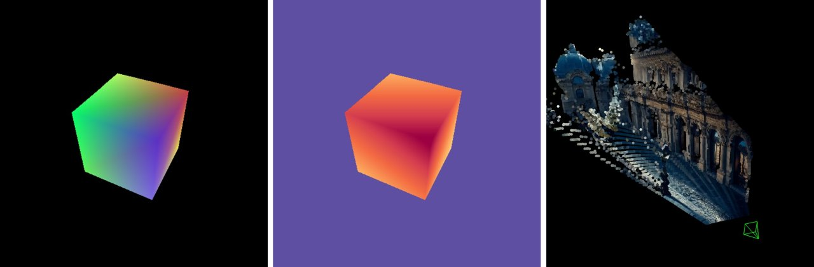

# utils3d



A collection of useful functions for 3D computer vision and graphics researchers in Python.

- **NumPy / PyTorch pairs**: most functions have both implementations.
- **Flat & non-modular**: standalone functions only, no classes, no hierarchies.
- **Native types**: always use raw Python / NumPy / PyTorch / SciPy.sparse types.
- **Vectorized only**: no Python loops beyond O(log N).

> ⚠️ *This repo changes quickly*. *Functions and interfaces may be added, removed, or modified at any time.*
> - Copy code if you only need a single function.
> - Use commit id or fork if you need stability.

## Install

Install via pip + git

```bash
pip install git+https://github.com/EasternJournalist/utils3d.git
```

or clone the repo and install 

```bash
git clone https://github.com/EasternJournalist/utils3d.git
pip install ./utils3d
```

## Documentation

- Use `utils3d.{function}` to call the function automatically selecting the backend based on the input type (Numpy ndarray or Pytorch tensor).
- Use `utils3d.{np/pt}.{function}` to specifically call the Numpy or Pytorch version.

The links below will take you to the source code of each function with detailed documentation and type hints.

### Transforms

| Function | Numpy | Pytorch |
| ---- | ---- | ---- |
| `utils3d.angle_between`<br>Calculate the angle between two (batches of) vectors. | [`utils3d.np.angle_between(v1, v2)`](utils3d/numpy/transforms.py#L1215) | [`utils3d.pt.angle_between(v1, v2, eps)`](utils3d/torch/transforms.py#L1284) | 
| `utils3d.axis_angle_to_matrix`<br>Convert axis-angle representation (rotation vector) to rotation matrix, whose direction is the axis of rotation and length is the angle of rotation | [`utils3d.np.axis_angle_to_matrix(axis_angle, eps)`](utils3d/numpy/transforms.py#L951) | [`utils3d.pt.axis_angle_to_matrix(axis_angle, eps)`](utils3d/torch/transforms.py#L892) | 
| `utils3d.axis_angle_to_quaternion`<br>Convert axis-angle representation (rotation vector) to quaternion (w, x, y, z) | - | [`utils3d.pt.axis_angle_to_quaternion(axis_angle, eps)`](utils3d/torch/transforms.py#L949) | 
| `utils3d.crop_intrinsics`<br>Evaluate the new intrinsics after cropping the image | [`utils3d.np.crop_intrinsics(intrinsics, size, cropped_top, cropped_left, cropped_height, cropped_width)`](utils3d/numpy/transforms.py#L395) | [`utils3d.pt.crop_intrinsics(intrinsics, size, cropped_top, cropped_left, cropped_height, cropped_width)`](utils3d/torch/transforms.py#L387) | 
| `utils3d.depth_buffer_to_linear`<br>OpenGL depth buffer to linear depth | [`utils3d.np.depth_buffer_to_linear(depth_buffer, near, far)`](utils3d/numpy/transforms.py#L529) | [`utils3d.pt.depth_buffer_to_linear(depth, near, far)`](utils3d/torch/transforms.py#L517) | 
| `utils3d.depth_linear_to_buffer`<br>Project linear depth to depth value in screen space | [`utils3d.np.depth_linear_to_buffer(depth, near, far)`](utils3d/numpy/transforms.py#L509) | [`utils3d.pt.depth_linear_to_buffer(depth, near, far)`](utils3d/torch/transforms.py#L498) | 
| `utils3d.euler_angles_to_matrix`<br>Convert rotations given as Euler angles in radians to rotation matrices. | [`utils3d.np.euler_angles_to_matrix(euler_angles, convention)`](utils3d/numpy/transforms.py#L900) | [`utils3d.pt.euler_angles_to_matrix(euler_angles, convention)`](utils3d/torch/transforms.py#L769) | 
| `utils3d.euler_axis_angle_rotation`<br>Return the rotation matrices for one of the rotations about an axis | [`utils3d.np.euler_axis_angle_rotation(axis, angle)`](utils3d/numpy/transforms.py#L870) | [`utils3d.pt.euler_axis_angle_rotation(axis, angle)`](utils3d/torch/transforms.py#L739) | 
| `utils3d.extrinsics_look_at`<br>Get OpenCV extrinsics matrix looking at something | [`utils3d.np.extrinsics_look_at(eye, look_at, up)`](utils3d/numpy/transforms.py#L239) | [`utils3d.pt.extrinsics_look_at(eye, look_at, up)`](utils3d/torch/transforms.py#L252) | 
| `utils3d.extrinsics_to_essential`<br>extrinsics matrix `[[R, t] [0, 0, 0, 1]]` such that `x' = R (x - t)` to essential matrix such that `x' E x = 0` | [`utils3d.np.extrinsics_to_essential(extrinsics)`](utils3d/numpy/transforms.py#L848) | [`utils3d.pt.extrinsics_to_essential(extrinsics)`](utils3d/torch/transforms.py#L1120) | 
| `utils3d.extrinsics_to_view`<br>OpenCV camera extrinsics to OpenGL view matrix | [`utils3d.np.extrinsics_to_view(extrinsics)`](utils3d/numpy/transforms.py#L328) | [`utils3d.pt.extrinsics_to_view(extrinsics)`](utils3d/torch/transforms.py#L320) | 
| `utils3d.focal_to_fov`<br> | [`utils3d.np.focal_to_fov(focal)`](utils3d/numpy/transforms.py#L198) | [`utils3d.pt.focal_to_fov(focal)`](utils3d/torch/transforms.py#L210) | 
| `utils3d.fov_to_focal`<br> | [`utils3d.np.fov_to_focal(fov)`](utils3d/numpy/transforms.py#L202) | [`utils3d.pt.fov_to_focal(fov)`](utils3d/torch/transforms.py#L214) | 
| `utils3d.interpolate_se3_matrix`<br>Linear interpolation between two SE(3) matrices. | [`utils3d.np.interpolate_se3_matrix(T1, T2, t)`](utils3d/numpy/transforms.py#L1115) | [`utils3d.pt.interpolate_se3_matrix(T1, T2, t)`](utils3d/torch/transforms.py#L1098) | 
| `utils3d.intrinsics_from_focal_center`<br>Get OpenCV intrinsics matrix | [`utils3d.np.intrinsics_from_focal_center(fx, fy, cx, cy)`](utils3d/numpy/transforms.py#L128) | [`utils3d.pt.intrinsics_from_focal_center(fx, fy, cx, cy)`](utils3d/torch/transforms.py#L136) | 
| `utils3d.intrinsics_from_fov`<br>Get normalized OpenCV intrinsics matrix from given field of view. | [`utils3d.np.intrinsics_from_fov(fov_x, fov_y, fov_max, fov_min, aspect_ratio)`](utils3d/numpy/transforms.py#L154) | [`utils3d.pt.intrinsics_from_fov(fov_x, fov_y, fov_max, fov_min, aspect_ratio)`](utils3d/torch/transforms.py#L166) | 
| `utils3d.intrinsics_to_fov`<br>NOTE: approximate FOV by assuming centered principal point | [`utils3d.np.intrinsics_to_fov(intrinsics)`](utils3d/numpy/transforms.py#L206) | [`utils3d.pt.intrinsics_to_fov(intrinsics)`](utils3d/torch/transforms.py#L218) | 
| `utils3d.intrinsics_to_perspective`<br>OpenCV intrinsics to OpenGL perspective matrix | [`utils3d.np.intrinsics_to_perspective(intrinsics, near, far)`](utils3d/numpy/transforms.py#L300) | [`utils3d.pt.intrinsics_to_perspective(intrinsics, near, far)`](utils3d/torch/transforms.py#L291) | 
| `utils3d.lerp`<br>Linear interpolation between two vectors. | [`utils3d.np.lerp(x1, x2, t)`](utils3d/numpy/transforms.py#L1025) | [`utils3d.pt.lerp(v1, v2, t)`](utils3d/torch/transforms.py#L1035) | 
| `utils3d.make_affine_matrix`<br>Make an affine transformation matrix from a linear matrix and a translation vector. | [`utils3d.np.make_affine_matrix(M, t)`](utils3d/numpy/transforms.py#L1006) | [`utils3d.pt.make_affine_matrix(M, t)`](utils3d/torch/transforms.py#L1142) | 
| `utils3d.matrix_to_axis_angle`<br>Convert a batch of 3x3 rotation matrices to axis-angle representation (rotation vector) | - | [`utils3d.pt.matrix_to_axis_angle(rot_mat, eps)`](utils3d/torch/transforms.py#L919) | 
| `utils3d.matrix_to_euler_angles`<br>Convert rotations given as rotation matrices to Euler angles in radians. | - | [`utils3d.pt.matrix_to_euler_angles(matrix, convention)`](utils3d/torch/transforms.py#L854) | 
| `utils3d.matrix_to_quaternion`<br>Convert 3x3 rotation matrix to quaternion (w, x, y, z) | [`utils3d.np.matrix_to_quaternion(rot_mat, eps)`](utils3d/numpy/transforms.py#L802) | [`utils3d.pt.matrix_to_quaternion(rot_mat, eps)`](utils3d/torch/transforms.py#L964) | 
| `utils3d.normalize_intrinsics`<br>Normalize intrinsics from pixel cooridnates to uv coordinates | [`utils3d.np.normalize_intrinsics(intrinsics, size, pixel_definition)`](utils3d/numpy/transforms.py#L354) | [`utils3d.pt.normalize_intrinsics(intrinsics, size, pixel_definition)`](utils3d/torch/transforms.py#L346) | 
| `utils3d.perspective_from_fov`<br>Get OpenGL perspective matrix from field of view  | [`utils3d.np.perspective_from_fov(fov_x, fov_y, fov_min, fov_max, aspect_ratio, near, far)`](utils3d/numpy/transforms.py#L59) | [`utils3d.pt.perspective_from_fov(fov_x, fov_y, fov_min, fov_max, aspect_ratio, near, far)`](utils3d/torch/transforms.py#L65) | 
| `utils3d.perspective_from_window`<br>Get OpenGL perspective matrix from the window of z=-1 projection plane | [`utils3d.np.perspective_from_window(left, right, bottom, top, near, far)`](utils3d/numpy/transforms.py#L101) | [`utils3d.pt.perspective_from_window(left, right, bottom, top, near, far)`](utils3d/torch/transforms.py#L109) | 
| `utils3d.perspective_to_intrinsics`<br>OpenGL perspective matrix to OpenCV intrinsics | [`utils3d.np.perspective_to_intrinsics(perspective)`](utils3d/numpy/transforms.py#L272) | [`utils3d.pt.perspective_to_intrinsics(perspective)`](utils3d/torch/transforms.py#L273) | 
| `utils3d.perspective_to_near_far`<br>Get near and far planes from OpenGL perspective matrix | [`utils3d.np.perspective_to_near_far(perspective)`](utils3d/numpy/transforms.py#L289) | - | 
| `utils3d.piecewise_interpolate_se3_matrix`<br>Linear spline interpolation for SE(3) matrices. | [`utils3d.np.piecewise_interpolate_se3_matrix(T, t, s, extrapolation_mode)`](utils3d/numpy/transforms.py#L1164) | - | 
| `utils3d.piecewise_lerp`<br>Linear spline interpolation. | [`utils3d.np.piecewise_lerp(x, t, s, extrapolation_mode)`](utils3d/numpy/transforms.py#L1135) | - | 
| `utils3d.pixel_to_ndc`<br>Convert pixel coordinates to NDC (Normalized Device Coordinates). | [`utils3d.np.pixel_to_ndc(pixel, size, pixel_definition)`](utils3d/numpy/transforms.py#L481) | [`utils3d.pt.pixel_to_ndc(pixel, size, pixel_definition)`](utils3d/torch/transforms.py#L471) | 
| `utils3d.pixel_to_uv`<br>Convert pixel space coordiantes to UV space coordinates. | [`utils3d.np.pixel_to_uv(pixel, size, pixel_definition)`](utils3d/numpy/transforms.py#L431) | [`utils3d.pt.pixel_to_uv(pixel, size, pixel_definition)`](utils3d/torch/transforms.py#L423) | 
| `utils3d.project`<br>Calculate projection.  | [`utils3d.np.project(points, intrinsics, extrinsics, view, projection)`](utils3d/numpy/transforms.py#L694) | [`utils3d.pt.project(points, intrinsics, extrinsics, view, projection)`](utils3d/torch/transforms.py#L656) | 
| `utils3d.project_cv`<br>Project 3D points to 2D following the OpenCV convention | [`utils3d.np.project_cv(points, intrinsics, extrinsics)`](utils3d/numpy/transforms.py#L578) | [`utils3d.pt.project_cv(points, intrinsics, extrinsics)`](utils3d/torch/transforms.py#L565) | 
| `utils3d.project_gl`<br>Project 3D points to 2D following the OpenGL convention (except for row major matrices) | [`utils3d.np.project_gl(points, projection, view)`](utils3d/numpy/transforms.py#L549) | [`utils3d.pt.project_gl(points, projection, view)`](utils3d/torch/transforms.py#L536) | 
| `utils3d.quaternion_to_axis_angle`<br>Convert a batch of quaternions (w, x, y, z) to axis-angle representation (rotation vector) | - | [`utils3d.pt.quaternion_to_axis_angle(quaternion, eps)`](utils3d/torch/transforms.py#L933) | 
| `utils3d.quaternion_to_matrix`<br>Converts a batch of quaternions (w, x, y, z) to rotation matrices | [`utils3d.np.quaternion_to_matrix(quaternion, eps)`](utils3d/numpy/transforms.py#L777) | [`utils3d.pt.quaternion_to_matrix(quaternion, eps)`](utils3d/torch/transforms.py#L1010) | 
| `utils3d.ray_intersection`<br>Compute the intersection/closest point of two D-dimensional rays | [`utils3d.np.ray_intersection(p1, d1, p2, d2)`](utils3d/numpy/transforms.py#L978) | - | 
| `utils3d.rotate_2d`<br>3x3 matrix for 2D rotation around a center | - | [`utils3d.pt.rotate_2d(theta, center)`](utils3d/torch/transforms.py#L1178) | 
| `utils3d.rotation_matrix_2d`<br>2x2 matrix for 2D rotation | - | [`utils3d.pt.rotation_matrix_2d(theta)`](utils3d/torch/transforms.py#L1160) | 
| `utils3d.rotation_matrix_from_vectors`<br>Rotation matrix that rotates v1 to v2 | [`utils3d.np.rotation_matrix_from_vectors(v1, v2)`](utils3d/numpy/transforms.py#L939) | [`utils3d.pt.rotation_matrix_from_vectors(v1, v2)`](utils3d/torch/transforms.py#L809) | 
| `utils3d.scale_2d`<br>Scale matrix for 2D scaling | - | [`utils3d.pt.scale_2d(scale, center)`](utils3d/torch/transforms.py#L1232) | 
| `utils3d.screen_coord_to_view_coord`<br>Unproject screen space coordinates to 3D view space following the OpenGL convention (except for row major matrices) | [`utils3d.np.screen_coord_to_view_coord(screen_coord, projection)`](utils3d/numpy/transforms.py#L640) | - | 
| `utils3d.skew_symmetric`<br>Skew symmetric matrix from a 3D vector | [`utils3d.np.skew_symmetric(v)`](utils3d/numpy/transforms.py#L927) | [`utils3d.pt.skew_symmetric(v)`](utils3d/torch/transforms.py#L797) | 
| `utils3d.slerp`<br>Spherical linear interpolation between two unit vectors. The vectors are assumed to be normalized. | [`utils3d.np.slerp(v1, v2, t)`](utils3d/numpy/transforms.py#L1069) | [`utils3d.pt.slerp(v1, v2, t, eps)`](utils3d/torch/transforms.py#L1052) | 
| `utils3d.slerp_rotation_matrix`<br>Spherical linear interpolation between two rotation matrices. | [`utils3d.np.slerp_rotation_matrix(R1, R2, t)`](utils3d/numpy/transforms.py#L1095) | [`utils3d.pt.slerp_rotation_matrix(R1, R2, t)`](utils3d/torch/transforms.py#L1078) | 
| `utils3d.transform`<br>Apply affine transformation(s) to a point or a set of points. | [`utils3d.np.transform(x, Ts)`](utils3d/numpy/transforms.py#L1193) | [`utils3d.pt.transform(x, Ts)`](utils3d/torch/transforms.py#L1262) | 
| `utils3d.translate_2d`<br>Translation matrix for 2D translation | - | [`utils3d.pt.translate_2d(translation)`](utils3d/torch/transforms.py#L1209) | 
| `utils3d.unproject`<br>Calculate inverse projection.  | [`utils3d.np.unproject(uv, depth, intrinsics, extrinsics, projection, view)`](utils3d/numpy/transforms.py#L735) | [`utils3d.pt.unproject(uv, depth, intrinsics, extrinsics, projection, view)`](utils3d/torch/transforms.py#L697) | 
| `utils3d.unproject_cv`<br>Unproject uv coordinates to 3D view space following the OpenCV convention | [`utils3d.np.unproject_cv(uv, depth, intrinsics, extrinsics)`](utils3d/numpy/transforms.py#L661) | [`utils3d.pt.unproject_cv(uv, depth, intrinsics, extrinsics)`](utils3d/torch/transforms.py#L625) | 
| `utils3d.unproject_gl`<br>Unproject screen space coordinates to 3D view space following the OpenGL convention (except for row major matrices) | [`utils3d.np.unproject_gl(uv, depth, projection, view)`](utils3d/numpy/transforms.py#L610) | [`utils3d.pt.unproject_gl(uv, depth, projection, view)`](utils3d/torch/transforms.py#L595) | 
| `utils3d.uv_to_pixel`<br>Convert UV space coordinates to pixel space coordinates. | [`utils3d.np.uv_to_pixel(uv, size, pixel_definition)`](utils3d/numpy/transforms.py#L457) | [`utils3d.pt.uv_to_pixel(uv, size, pixel_definition)`](utils3d/torch/transforms.py#L447) | 
| `utils3d.view_look_at`<br>Get OpenGL view matrix looking at something | [`utils3d.np.view_look_at(eye, look_at, up)`](utils3d/numpy/transforms.py#L212) | [`utils3d.pt.view_look_at(eye, look_at, up)`](utils3d/torch/transforms.py#L225) | 
| `utils3d.view_to_extrinsics`<br>OpenGL view matrix to OpenCV camera extrinsics | [`utils3d.np.view_to_extrinsics(view)`](utils3d/numpy/transforms.py#L341) | [`utils3d.pt.view_to_extrinsics(view)`](utils3d/torch/transforms.py#L333) | 


### Maps

| Function | Numpy | Pytorch |
| ---- | ---- | ---- |
| `utils3d.bounding_rect_from_mask`<br>Get bounding rectangle of a mask | - | [`utils3d.pt.bounding_rect_from_mask(mask)`](utils3d/torch/maps.py#L366) | 
| `utils3d.build_mesh_from_depth_map`<br>Get a mesh by lifting depth map to 3D, while removing depths of large depth difference. | [`utils3d.np.build_mesh_from_depth_map(depth, other_maps, intrinsics, extrinsics, atol, rtol, tri)`](utils3d/numpy/maps.py#L187) | [`utils3d.pt.build_mesh_from_depth_map(depth, other_maps, intrinsics, extrinsics, atol, rtol, tri)`](utils3d/torch/maps.py#L197) | 
| `utils3d.build_mesh_from_map`<br>Get a mesh regarding image pixel uv coordinates as vertices and image grid as faces. | [`utils3d.np.build_mesh_from_map(maps, mask, tri)`](utils3d/numpy/maps.py#L154) | [`utils3d.pt.build_mesh_from_map(maps, mask, tri)`](utils3d/torch/maps.py#L158) | 
| `utils3d.chessboard`<br>Get a chessboard image | [`utils3d.np.chessboard(size, grid_size, color_a, color_b)`](utils3d/numpy/maps.py#L425) | [`utils3d.pt.chessboard(size, grid_size, color_a, color_b)`](utils3d/torch/maps.py#L383) | 
| `utils3d.colorize_depth_map`<br>Colorize depth map for visualization. | [`utils3d.np.colorize_depth_map(depth, mask, normalize, cmap)`](utils3d/numpy/maps.py#L586) | - | 
| `utils3d.colorize_normal_map`<br>Colorize normal map for visualization. Value range is [-1, 1]. | [`utils3d.np.colorize_normal_map(normal, mask, flip_yz)`](utils3d/numpy/maps.py#L613) | - | 
| `utils3d.depth_map_aliasing`<br>Compute the map that indicates the aliasing of x depth map, identifying pixels which neither close to the maximum nor the minimum of its neighbors. | [`utils3d.np.depth_map_aliasing(depth, atol, rtol, kernel_size, mask)`](utils3d/numpy/maps.py#L256) | [`utils3d.pt.depth_map_aliasing(depth, atol, rtol, kernel_size, mask)`](utils3d/torch/maps.py#L265) | 
| `utils3d.depth_map_edge`<br>Compute the edge mask from depth map. The edge is defined as the pixels whose neighbors have large difference in depth. | [`utils3d.np.depth_map_edge(depth, atol, rtol, kernel_size, mask)`](utils3d/numpy/maps.py#L229) | [`utils3d.pt.depth_map_edge(depth, atol, rtol, kernel_size, mask)`](utils3d/torch/maps.py#L239) | 
| `utils3d.depth_map_to_normal_map`<br>Calculate normal map from depth map. Value range is [-1, 1]. Normal direction in OpenCV identity camera's coordinate system. | [`utils3d.np.depth_map_to_normal_map(depth, intrinsics, mask, edge_threshold)`](utils3d/numpy/maps.py#L379) | [`utils3d.pt.depth_map_to_normal_map(depth, intrinsics, mask)`](utils3d/torch/maps.py#L344) | 
| `utils3d.depth_map_to_point_map`<br>Unproject depth map to 3D points. | [`utils3d.np.depth_map_to_point_map(depth, intrinsics, extrinsics)`](utils3d/numpy/maps.py#L399) | [`utils3d.pt.depth_map_to_point_map(depth, intrinsics, extrinsics)`](utils3d/torch/maps.py#L359) | 
| `utils3d.masked_area_resize`<br>Resize 2D map by area sampling with mask awareness. | [`utils3d.np.masked_area_resize(image, mask, size)`](utils3d/numpy/maps.py#L518) | [`utils3d.pt.masked_area_resize(image, mask, size)`](utils3d/torch/maps.py#L477) | 
| `utils3d.masked_nearest_resize`<br>Resize image(s) by nearest sampling with mask awareness.  | [`utils3d.np.masked_nearest_resize(image, mask, size, return_index)`](utils3d/numpy/maps.py#L448) | [`utils3d.pt.masked_nearest_resize(image, mask, size, return_index)`](utils3d/torch/maps.py#L406) | 
| `utils3d.normal_map_edge`<br>Compute the edge mask from normal map. | [`utils3d.np.normal_map_edge(normals, tol, kernel_size, mask)`](utils3d/numpy/maps.py#L284) | - | 
| `utils3d.pixel_coord_map`<br>Get image pixel coordinates map, where (0, 0) is the top-left corner of the top-left pixel, and (width, height) is the bottom-right corner of the bottom-right pixel. | [`utils3d.np.pixel_coord_map(size, top, left, definition, dtype)`](utils3d/numpy/maps.py#L73) | [`utils3d.pt.pixel_coord_map(size, top, left, definition, dtype, device)`](utils3d/torch/maps.py#L75) | 
| `utils3d.point_map_to_normal_map`<br>Calculate normal map from point map. Value range is [-1, 1].  | [`utils3d.np.point_map_to_normal_map(point, mask, edge_threshold)`](utils3d/numpy/maps.py#L322) | [`utils3d.pt.point_map_to_normal_map(point, mask)`](utils3d/torch/maps.py#L299) | 
| `utils3d.screen_coord_map`<br>Get screen space coordinate map, where (0., 0.) is the bottom-left corner of the image, and (1., 1.) is the top-right corner of the image. | [`utils3d.np.screen_coord_map(size, top, left, bottom, right, dtype)`](utils3d/numpy/maps.py#L121) | [`utils3d.pt.screen_coord_map(size, top, left, bottom, right, dtype, device)`](utils3d/torch/maps.py#L124) | 
| `utils3d.uv_map`<br>Get image UV space coordinate map, where (0., 0.) is the top-left corner of the image, and (1., 1.) is the bottom-right corner of the image. | [`utils3d.np.uv_map(size, top, left, bottom, right, dtype)`](utils3d/numpy/maps.py#L32) | [`utils3d.pt.uv_map(size, top, left, bottom, right, dtype, device)`](utils3d/torch/maps.py#L32) | 


### Mesh

| Function | Numpy | Pytorch |
| ---- | ---- | ---- |
| `utils3d.calc_quad_candidates`<br>Calculate the candidate quad faces. | [`utils3d.np.calc_quad_candidates(edges, face2edge, edge2face)`](utils3d/numpy/mesh.py#L523) | - | 
| `utils3d.calc_quad_direction`<br>Calculate the direction of each candidate quad face. | [`utils3d.np.calc_quad_direction(vertices, quads)`](utils3d/numpy/mesh.py#L635) | - | 
| `utils3d.calc_quad_distortion`<br>Calculate the distortion of each candidate quad face. | [`utils3d.np.calc_quad_distortion(vertices, quads)`](utils3d/numpy/mesh.py#L584) | - | 
| `utils3d.calc_quad_smoothness`<br>Calculate the smoothness of each candidate quad face connection. | [`utils3d.np.calc_quad_smoothness(quad2edge, quad2adj, quads_direction)`](utils3d/numpy/mesh.py#L676) | - | 
| `utils3d.compute_boundaries`<br>Compute boundary edges of a mesh. | - | [`utils3d.pt.compute_boundaries(faces, edges, face2edge, edge_degrees)`](utils3d/torch/mesh.py#L456) | 
| `utils3d.compute_edge_connected_components`<br>Compute connected edges of a mesh. | - | [`utils3d.pt.compute_edge_connected_components(edges)`](utils3d/torch/mesh.py#L417) | 
| `utils3d.compute_face_corner_angles`<br>Compute face corner angles of a mesh | [`utils3d.np.compute_face_corner_angles(vertices, faces)`](utils3d/numpy/mesh.py#L87) | [`utils3d.pt.compute_face_corner_angles(vertices, faces)`](utils3d/torch/mesh.py#L119) | 
| `utils3d.compute_face_corner_normals`<br>Compute the face corner normals of a mesh | [`utils3d.np.compute_face_corner_normals(vertices, faces, normalize)`](utils3d/numpy/mesh.py#L108) | [`utils3d.pt.compute_face_corner_normals(vertices, faces, normalize)`](utils3d/torch/mesh.py#L141) | 
| `utils3d.compute_face_corner_tangents`<br>Compute the face corner tangent (and bitangent) vectors of a mesh | [`utils3d.np.compute_face_corner_tangents(vertices, uv, faces_vertices, faces_uv, normalize)`](utils3d/numpy/mesh.py#L133) | [`utils3d.pt.compute_face_corner_tangents(vertices, uv, faces_vertices, faces_uv, normalize)`](utils3d/torch/mesh.py#L166) | 
| `utils3d.compute_face_normals`<br>Compute face normals of a mesh | [`utils3d.np.compute_face_normals(vertices, faces)`](utils3d/numpy/mesh.py#L169) | [`utils3d.pt.compute_face_normals(vertices, faces)`](utils3d/torch/mesh.py#L202) | 
| `utils3d.compute_face_tangents`<br>Compute the face corner tangent (and bitangent) vectors of a mesh | [`utils3d.np.compute_face_tangents(vertices, uv, faces_vertices, faces_uv, normalize)`](utils3d/numpy/mesh.py#L197) | [`utils3d.pt.compute_face_tangents(vertices, uv, faces_vertices, faces_uv, normalize)`](utils3d/torch/mesh.py#L230) | 
| `utils3d.compute_vertex_normals`<br>Compute vertex normals of a triangular mesh by averaging neighboring face normals | [`utils3d.np.compute_vertex_normals(vertices, faces, weighted)`](utils3d/numpy/mesh.py#L233) | - | 
| `utils3d.create_camera_frustum_mesh`<br>Create a triangle mesh of camera frustum. | [`utils3d.np.create_camera_frustum_mesh(extrinsics, intrinsics, depth)`](utils3d/numpy/mesh.py#L453) | - | 
| `utils3d.create_cube_mesh`<br>Create a cube mesh of size 1 centered at origin. | [`utils3d.np.create_cube_mesh(tri)`](utils3d/numpy/mesh.py#L422) | - | 
| `utils3d.create_icosahedron_mesh`<br>Create an icosahedron mesh of centered at origin. | [`utils3d.np.create_icosahedron_mesh()`](utils3d/numpy/mesh.py#L479) | - | 
| `utils3d.create_square_mesh`<br>Create a square mesh of area 1 centered at origin in the xy-plane. | [`utils3d.np.create_square_mesh(tri)`](utils3d/numpy/mesh.py#L404) | - | 
| `utils3d.flatten_mesh_indices`<br> | [`utils3d.np.flatten_mesh_indices(args)`](utils3d/numpy/mesh.py#L391) | - | 
| `utils3d.get_mesh_connected_components`<br>Compute connected faces of a mesh. | - | [`utils3d.pt.get_mesh_connected_components(faces, edges, face2edge)`](utils3d/torch/mesh.py#L375) | 
| `utils3d.get_mesh_dual_graph`<br>Get dual graph of a mesh. (Mesh face as dual graph's vertex, adjacency by edge sharing) | - | [`utils3d.pt.get_mesh_dual_graph(faces)`](utils3d/torch/mesh.py#L512) | 
| `utils3d.get_mesh_edges`<br>Get edges of a mesh. Optionally return additional mappings. | [`utils3d.np.get_mesh_edges(faces, directed, return_face2edge, return_edge2face, return_opposite_edge, return_counts)`](utils3d/numpy/mesh.py#L921) | [`utils3d.pt.get_mesh_edges(faces, directed, return_face2edge, return_edge2face, return_opposite_edge, return_counts)`](utils3d/torch/mesh.py#L297) | 
| `utils3d.laplacian`<br>Laplacian smooth with cotangent weights | - | [`utils3d.pt.laplacian(vertices, faces, weight)`](utils3d/torch/mesh.py#L701) | 
| `utils3d.laplacian_hc_smooth_mesh`<br>HC algorithm from Improved Laplacian Smoothing of Noisy Surface Meshes by J.Vollmer et al. | - | [`utils3d.pt.laplacian_hc_smooth_mesh(vertices, faces, times, alpha, beta, weight)`](utils3d/torch/mesh.py#L760) | 
| `utils3d.laplacian_smooth_mesh`<br>Laplacian smooth with cotangent weights | - | [`utils3d.pt.laplacian_smooth_mesh(vertices, faces, weight, times)`](utils3d/torch/mesh.py#L730) | 
| `utils3d.merge_duplicate_vertices`<br>Merge duplicate vertices of a triangular mesh.  | [`utils3d.np.merge_duplicate_vertices(vertices, faces, tol)`](utils3d/numpy/mesh.py#L281) | [`utils3d.pt.merge_duplicate_vertices(vertices, faces, tol)`](utils3d/torch/mesh.py#L579) | 
| `utils3d.merge_meshes`<br>Merge multiple meshes into one mesh. Vertices will be no longer shared. | [`utils3d.np.merge_meshes(meshes)`](utils3d/numpy/mesh.py#L498) | - | 
| `utils3d.remove_corrupted_faces`<br>Remove corrupted faces (faces with duplicated vertices) | [`utils3d.np.remove_corrupted_faces(faces)`](utils3d/numpy/mesh.py#L267) | [`utils3d.pt.remove_corrupted_faces(faces)`](utils3d/torch/mesh.py#L563) | 
| `utils3d.remove_isolated_pieces`<br>Remove isolated pieces of a mesh.  | - | [`utils3d.pt.remove_isolated_pieces(vertices, faces, connected_components, thresh_num_faces, thresh_radius, thresh_boundary_ratio, remove_unreferenced)`](utils3d/torch/mesh.py#L604) | 
| `utils3d.remove_unused_vertices`<br>Remove unreferenced vertices of a mesh.  | [`utils3d.np.remove_unused_vertices(faces, vertice_attrs, return_indices)`](utils3d/numpy/mesh.py#L306) | [`utils3d.pt.remove_unused_vertices(faces, vertice_attrs, return_indices)`](utils3d/torch/mesh.py#L534) | 
| `utils3d.solve_quad`<br>Solve the quad mesh from the candidate quad faces. | [`utils3d.np.solve_quad(face2edge, edge2face, quad2adj, quads_distortion, quads_smoothness, quads_valid)`](utils3d/numpy/mesh.py#L705) | - | 
| `utils3d.solve_quad_qp`<br>Solve the quad mesh from the candidate quad faces. | [`utils3d.np.solve_quad_qp(face2edge, edge2face, quad2adj, quads_distortion, quads_smoothness, quads_valid)`](utils3d/numpy/mesh.py#L817) | - | 
| `utils3d.subdivide_mesh`<br>Subdivide a triangular mesh by splitting each triangle into 4 smaller triangles. | [`utils3d.np.subdivide_mesh(vertices, faces, level)`](utils3d/numpy/mesh.py#L335) | [`utils3d.pt.subdivide_mesh(vertices, faces, n)`](utils3d/torch/mesh.py#L670) | 
| `utils3d.taubin_smooth_mesh`<br>Taubin smooth mesh | - | [`utils3d.pt.taubin_smooth_mesh(vertices, faces, lambda_, mu_)`](utils3d/torch/mesh.py#L743) | 
| `utils3d.tri_to_quad`<br>Convert a triangle mesh to a quad mesh. | [`utils3d.np.tri_to_quad(vertices, faces)`](utils3d/numpy/mesh.py#L902) | - | 
| `utils3d.triangulate_mesh`<br>Triangulate a polygonal mesh. | [`utils3d.np.triangulate_mesh(faces, vertices, method)`](utils3d/numpy/mesh.py#L39) | [`utils3d.pt.triangulate_mesh(faces, vertices, method)`](utils3d/torch/mesh.py#L71) | 


### Rasterization

| Function | Numpy | Pytorch |
| ---- | ---- | ---- |
| `utils3d.RastContext`<br>Create a rasterization context. Nothing but a wrapper of nvdiffrast.torch.RasterizeCudaContext or nvdiffrast.torch.RasterizeGLContext. | [`utils3d.np.RastContext(args, kwargs)`](utils3d/numpy/rasterization.py#L51) | [`utils3d.pt.RastContext(nvd_ctx, backend, device)`](utils3d/torch/rasterization.py#L21) | 
| `utils3d.rasterize_lines`<br>Rasterize lines. | [`utils3d.np.rasterize_lines(ctx, size, vertices, lines, attributes, attributes_domain, view, projection, line_width, return_depth, return_interpolation, background_image, background_depth, background_interpolation_id, background_interpolation_uv)`](utils3d/numpy/rasterization.py#L896) | - | 
| `utils3d.rasterize_point_cloud`<br>Rasterize point cloud. | [`utils3d.np.rasterize_point_cloud(ctx, size, points, point_sizes, point_size_in, point_shape, attributes, view, projection, return_depth, return_point_id, background_image, background_depth, background_point_id)`](utils3d/numpy/rasterization.py#L1117) | - | 
| `utils3d.rasterize_triangles`<br>Rasterize triangles. | [`utils3d.np.rasterize_triangles(ctx, size, vertices, attributes, attributes_domain, faces, view, projection, cull_backface, return_depth, return_interpolation, background_image, background_depth, background_interpolation_id, background_interpolation_uv)`](utils3d/numpy/rasterization.py#L442) | [`utils3d.pt.rasterize_triangles(ctx, width, height, vertices, faces, attr, uv, texture, model, view, projection, antialiasing, diff_attrs)`](utils3d/torch/rasterization.py#L38) | 
| `utils3d.rasterize_triangles_peeling`<br>Rasterize triangles with depth peeling. | [`utils3d.np.rasterize_triangles_peeling(ctx, size, vertices, attributes, attributes_domain, faces, view, projection, cull_backface, return_depth, return_interpolation)`](utils3d/numpy/rasterization.py#L665) | [`utils3d.pt.rasterize_triangles_peeling(ctx, vertices, faces, width, height, max_layers, attr, uv, texture, model, view, projection, antialiasing, diff_attrs)`](utils3d/torch/rasterization.py#L145) | 
| `utils3d.sample_texture`<br>Sample from a texture map with a UV map. | [`utils3d.np.sample_texture(ctx, uv_map, texture_map, interpolation, mipmap_level, repeat, anisotropic)`](utils3d/numpy/rasterization.py#L1306) | [`utils3d.pt.sample_texture(texture, uv, uv_da)`](utils3d/torch/rasterization.py#L271) | 
| `utils3d.test_rasterization`<br>Test if rasterization works. It will render a cube with random colors and save it as a CHECKME.png file. | [`utils3d.np.test_rasterization(ctx)`](utils3d/numpy/rasterization.py#L1457) | - | 
| `utils3d.texture_composite`<br>Composite textures with depth peeling output. | - | [`utils3d.pt.texture_composite(texture, uv, uv_da, background)`](utils3d/torch/rasterization.py#L291) | 
| `utils3d.warp_image_by_depth`<br>Warp image by depth.  | - | [`utils3d.pt.warp_image_by_depth(ctx, depth, image, mask, width, height, extrinsics_src, extrinsics_tgt, intrinsics_src, intrinsics_tgt, near, far, antialiasing, backslash, padding, return_uv, return_dr)`](utils3d/torch/rasterization.py#L332) | 
| `utils3d.warp_image_by_forward_flow`<br>Warp image by forward flow. | - | [`utils3d.pt.warp_image_by_forward_flow(ctx, image, flow, depth, antialiasing, backslash)`](utils3d/torch/rasterization.py#L502) | 


### Utils

| Function | Numpy | Pytorch |
| ---- | ---- | ---- |
| `utils3d.csr_eliminate_zeros`<br>Remove zero elements from a sparse CSR tensor. | - | [`utils3d.pt.csr_eliminate_zeros(input)`](utils3d/torch/utils.py#L162) | 
| `utils3d.csr_matrix_from_indices`<br>Convert a regular indices array to a sparse CSR adjacency matrix format | [`utils3d.np.csr_matrix_from_indices(indices, n_cols)`](utils3d/numpy/utils.py#L166) | [`utils3d.pt.csr_matrix_from_indices(indices, n_cols)`](utils3d/torch/utils.py#L144) | 
| `utils3d.lookup`<br>Look up `query` in `key` like a dictionary. | [`utils3d.np.lookup(key, query, value, default_value)`](utils3d/numpy/utils.py#L127) | [`utils3d.pt.lookup(key, query, value, default_value)`](utils3d/torch/utils.py#L114) | 
| `utils3d.masked_max`<br>Similar to torch.max, but with mask | - | [`utils3d.pt.masked_max(input, mask, dim, keepdim)`](utils3d/torch/utils.py#L105) | 
| `utils3d.masked_min`<br>Similar to torch.min, but with mask | - | [`utils3d.pt.masked_min(input, mask, dim, keepdim)`](utils3d/torch/utils.py#L96) | 
| `utils3d.max_pool_1d`<br> | [`utils3d.np.max_pool_1d(x, kernel_size, stride, padding, axis)`](utils3d/numpy/utils.py#L99) | - | 
| `utils3d.max_pool_2d`<br> | [`utils3d.np.max_pool_2d(x, kernel_size, stride, padding, axis)`](utils3d/numpy/utils.py#L116) | - | 
| `utils3d.max_pool_nd`<br> | [`utils3d.np.max_pool_nd(x, kernel_size, stride, padding, axis)`](utils3d/numpy/utils.py#L110) | - | 
| `utils3d.segment_roll`<br>Roll the data tensor within each segment defined by offsets. | [`utils3d.np.segment_roll(data, offsets, shift)`](utils3d/numpy/utils.py#L156) | [`utils3d.pt.segment_roll(data, offsets, shift)`](utils3d/torch/utils.py#L179) | 
| `utils3d.sliding_window`<br>Get a sliding window of the input array. | [`utils3d.np.sliding_window(x, window_size, stride, pad_size, pad_mode, pad_value, axis)`](utils3d/numpy/utils.py#L22) | [`utils3d.pt.sliding_window(x, window_size, stride, pad_size, pad_mode, pad_value, dim)`](utils3d/torch/utils.py#L24) | 
