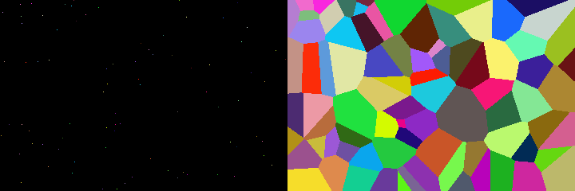
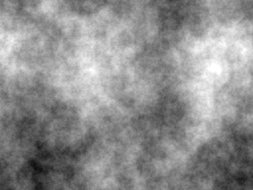
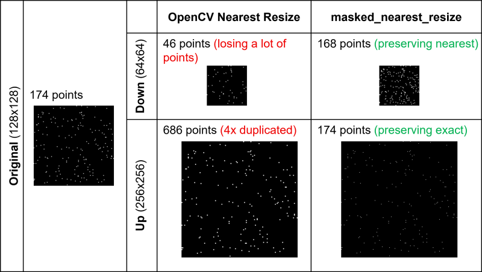

# utils3d


A pure-Python collection of useful functions for 3D computer vision and graphics research.

- **NumPy / PyTorch pairs**: most functions have both implementations.
- **Flat & non-modular**: standalone functions only, no classes, no hierarchies.
- **Native types**: always use native Python / NumPy / PyTorch types.
- **Vectorized only**: no Python loops beyond O(log N).

## Install

⚠️ *This repo changes quickly*. *Functions may be added, removed, or modified at any time.*

* If you are looking for **one or two specific functions**, feel free to copy them directly from the source code. This repo may serve a better purpose as a reference implementation.

* If installing `utils3d` as a **dependency**, use commit id or fork one if you need stability.

    ```bash
    pip install git+https://github.com/EasternJournalist/utils3d.git@<commit_id>
    ```

* If you are willing to **accept the latest changes**, fork this repo and join me in making 3D research easier!

## Documentation

- Use `utils3d.{function}` to call the function automatically selecting the backend based on the input type (Numpy ndarray or Pytorch tensor).
- Use `utils3d.{np/pt}.{function}` to specifically call the Numpy or Pytorch version.

The links below will take you to the source code of each function with detailed documentation and type hints.


### Contents
- [Camera & Projection & Coordinate Transforms](#camera--projection--coordinate-transforms) 
- [Pose Solver](#pose-solver)
- [Image & Maps](#image--maps)
- [Mesh](#mesh)
- [Rasterization](#rasterization)
- [Array Utils](#array-utils)
- [Segment Array Operations](#segment-array-operations) 
- [IO](#io)


### Camera & Projection & Coordinate Transforms

| Function | Numpy | Pytorch |
| ---- | ---- | ---- |
| `utils3d.angle_between`<br>Calculate the angle between two (batches of) vectors. | [`utils3d.np.angle_between(v1, v2)`](utils3d/numpy/transforms.py#L1431) | [`utils3d.pt.angle_between(v1, v2, eps)`](utils3d/torch/transforms.py#L1404) | 
| `utils3d.axis_angle_to_matrix`<br>Convert axis-angle representation (rotation vector) to rotation matrix, whose direction is the axis of rotation and length is the angle of rotation | [`utils3d.np.axis_angle_to_matrix(axis_angle)`](utils3d/numpy/transforms.py#L1035) | [`utils3d.pt.axis_angle_to_matrix(axis_angle, eps)`](utils3d/torch/transforms.py#L941) | 
| `utils3d.axis_angle_to_quaternion`<br>Convert axis-angle representation (rotation vector) to quaternion (w, x, y, z) | [`utils3d.np.axis_angle_to_quaternion(axis_angle)`](utils3d/numpy/transforms.py#L1062) | [`utils3d.pt.axis_angle_to_quaternion(axis_angle, eps)`](utils3d/torch/transforms.py#L998) | 
| `utils3d.crop_intrinsics`<br>Evaluate the new intrinsics after cropping the image | [`utils3d.np.crop_intrinsics(intrinsics, size, cropped_top, cropped_left, cropped_height, cropped_width)`](utils3d/numpy/transforms.py#L447) | [`utils3d.pt.crop_intrinsics(intrinsics, size, cropped_top, cropped_left, cropped_height, cropped_width)`](utils3d/torch/transforms.py#L436) | 
| `utils3d.denormalize_intrinsics`<br>Denormalize intrinsics from uv cooridnates to pixel coordinates | [`utils3d.np.denormalize_intrinsics(intrinsics, size, pixel_convention)`](utils3d/numpy/transforms.py#L406) | [`utils3d.pt.denormalize_intrinsics(intrinsics, size, pixel_convention)`](utils3d/torch/transforms.py#L395) | 
| `utils3d.depth_buffer_to_linear`<br>OpenGL depth buffer to linear depth | [`utils3d.np.depth_buffer_to_linear(depth_buffer, near, far)`](utils3d/numpy/transforms.py#L583) | [`utils3d.pt.depth_buffer_to_linear(depth, near, far)`](utils3d/torch/transforms.py#L566) | 
| `utils3d.depth_linear_to_buffer`<br>Project linear depth to depth value in screen space | [`utils3d.np.depth_linear_to_buffer(depth, near, far)`](utils3d/numpy/transforms.py#L563) | [`utils3d.pt.depth_linear_to_buffer(depth, near, far)`](utils3d/torch/transforms.py#L547) | 
| `utils3d.euler_angles_to_matrix`<br>Convert rotations given as Euler angles in radians to rotation matrices. | [`utils3d.np.euler_angles_to_matrix(euler_angles, convention)`](utils3d/numpy/transforms.py#L984) | [`utils3d.pt.euler_angles_to_matrix(euler_angles, convention)`](utils3d/torch/transforms.py#L818) | 
| `utils3d.euler_axis_angle_rotation`<br>Return the rotation matrices for one of the rotations about an axis | [`utils3d.np.euler_axis_angle_rotation(axis, angle)`](utils3d/numpy/transforms.py#L954) | [`utils3d.pt.euler_axis_angle_rotation(axis, angle)`](utils3d/torch/transforms.py#L788) | 
| `utils3d.extrinsics_look_at`<br>Get OpenCV extrinsics matrix looking at something | [`utils3d.np.extrinsics_look_at(eye, look_at, up)`](utils3d/numpy/transforms.py#L251) | [`utils3d.pt.extrinsics_look_at(eye, look_at, up)`](utils3d/torch/transforms.py#L260) | 
| `utils3d.extrinsics_to_essential`<br>extrinsics matrix `[[R, t] [0, 0, 0, 1]]` such that `x' = R (x - t)` to essential matrix such that `x' E x = 0` | [`utils3d.np.extrinsics_to_essential(extrinsics)`](utils3d/numpy/transforms.py#L932) | [`utils3d.pt.extrinsics_to_essential(extrinsics)`](utils3d/torch/transforms.py#L1185) | 
| `utils3d.extrinsics_to_view`<br>OpenCV camera extrinsics to OpenGL view matrix | [`utils3d.np.extrinsics_to_view(extrinsics)`](utils3d/numpy/transforms.py#L339) | [`utils3d.pt.extrinsics_to_view(extrinsics)`](utils3d/torch/transforms.py#L328) | 
| `utils3d.focal_to_fov`<br> | [`utils3d.np.focal_to_fov(focal)`](utils3d/numpy/transforms.py#L210) | [`utils3d.pt.focal_to_fov(focal)`](utils3d/torch/transforms.py#L218) | 
| `utils3d.fov_to_focal`<br> | [`utils3d.np.fov_to_focal(fov)`](utils3d/numpy/transforms.py#L214) | [`utils3d.pt.fov_to_focal(fov)`](utils3d/torch/transforms.py#L222) | 
| `utils3d.interpolate_se3_matrix`<br>Linear interpolation between two SE(3) matrices. | [`utils3d.np.interpolate_se3_matrix(T1, T2, t)`](utils3d/numpy/transforms.py#L1275) | [`utils3d.pt.interpolate_se3_matrix(T1, T2, t)`](utils3d/torch/transforms.py#L1163) | 
| `utils3d.intrinsics_from_focal_center`<br>Get OpenCV intrinsics matrix | [`utils3d.np.intrinsics_from_focal_center(fx, fy, cx, cy)`](utils3d/numpy/transforms.py#L135) | [`utils3d.pt.intrinsics_from_focal_center(fx, fy, cx, cy)`](utils3d/torch/transforms.py#L139) | 
| `utils3d.intrinsics_from_fov`<br>Get normalized OpenCV intrinsics matrix from given field of view. | [`utils3d.np.intrinsics_from_fov(fov_x, fov_y, fov_max, fov_min, cx, cy, aspect_ratio)`](utils3d/numpy/transforms.py#L161) | [`utils3d.pt.intrinsics_from_fov(fov_x, fov_y, fov_max, fov_min, cx, cy, aspect_ratio)`](utils3d/torch/transforms.py#L169) | 
| `utils3d.intrinsics_to_fov`<br>NOTE: approximate FOV by assuming centered principal point | [`utils3d.np.intrinsics_to_fov(intrinsics)`](utils3d/numpy/transforms.py#L218) | [`utils3d.pt.intrinsics_to_fov(intrinsics)`](utils3d/torch/transforms.py#L226) | 
| `utils3d.intrinsics_to_perspective`<br>OpenCV intrinsics to OpenGL perspective matrix | [`utils3d.np.intrinsics_to_perspective(intrinsics, near, far)`](utils3d/numpy/transforms.py#L312) | [`utils3d.pt.intrinsics_to_perspective(intrinsics, near, far)`](utils3d/torch/transforms.py#L299) | 
| `utils3d.lerp`<br>Linear interpolation between two vectors. | [`utils3d.np.lerp(x1, x2, t)`](utils3d/numpy/transforms.py#L1211) | [`utils3d.pt.lerp(v1, v2, t)`](utils3d/torch/transforms.py#L1100) | 
| `utils3d.make_affine_matrix`<br>Make an affine transformation matrix from a linear matrix and a translation vector. | [`utils3d.np.make_affine_matrix(M, t)`](utils3d/numpy/transforms.py#L1192) | [`utils3d.pt.make_affine_matrix(M, t)`](utils3d/torch/transforms.py#L1207) | 
| `utils3d.matrix_to_axis_angle`<br>Convert a batch of 3x3 rotation matrices to axis-angle representation (rotation vector) | [`utils3d.np.matrix_to_axis_angle(rot_mat)`](utils3d/numpy/transforms.py#L918) | [`utils3d.pt.matrix_to_axis_angle(rot_mat, eps)`](utils3d/torch/transforms.py#L968) | 
| `utils3d.matrix_to_euler_angles`<br>Convert rotations given as rotation matrices to Euler angles in radians. | [`utils3d.np.matrix_to_euler_angles(matrix, convention)`](utils3d/numpy/transforms.py#L1110) | [`utils3d.pt.matrix_to_euler_angles(matrix, convention)`](utils3d/torch/transforms.py#L903) | 
| `utils3d.matrix_to_quaternion`<br>Convert 3x3 rotation matrix to quaternion (w, x, y, z) | [`utils3d.np.matrix_to_quaternion(rot_mat)`](utils3d/numpy/transforms.py#L856) | [`utils3d.pt.matrix_to_quaternion(rot_mat, eps)`](utils3d/torch/transforms.py#L1013) | 
| `utils3d.normalize_intrinsics`<br>Normalize intrinsics from pixel cooridnates to uv coordinates | [`utils3d.np.normalize_intrinsics(intrinsics, size, pixel_convention)`](utils3d/numpy/transforms.py#L365) | [`utils3d.pt.normalize_intrinsics(intrinsics, size, pixel_convention)`](utils3d/torch/transforms.py#L354) | 
| `utils3d.perspective_from_fov`<br>Get OpenGL perspective matrix from field of view  | [`utils3d.np.perspective_from_fov(fov_x, fov_y, fov_min, fov_max, aspect_ratio, near, far)`](utils3d/numpy/transforms.py#L66) | [`utils3d.pt.perspective_from_fov(fov_x, fov_y, fov_min, fov_max, aspect_ratio, near, far)`](utils3d/torch/transforms.py#L68) | 
| `utils3d.perspective_from_window`<br>Get OpenGL perspective matrix from the window of z=-1 projection plane | [`utils3d.np.perspective_from_window(left, right, bottom, top, near, far)`](utils3d/numpy/transforms.py#L108) | [`utils3d.pt.perspective_from_window(left, right, bottom, top, near, far)`](utils3d/torch/transforms.py#L112) | 
| `utils3d.perspective_to_intrinsics`<br>OpenGL perspective matrix to OpenCV intrinsics | [`utils3d.np.perspective_to_intrinsics(perspective)`](utils3d/numpy/transforms.py#L284) | [`utils3d.pt.perspective_to_intrinsics(perspective)`](utils3d/torch/transforms.py#L281) | 
| `utils3d.perspective_to_near_far`<br>Get near and far planes from OpenGL perspective matrix | [`utils3d.np.perspective_to_near_far(perspective)`](utils3d/numpy/transforms.py#L301) | - | 
| `utils3d.piecewise_interpolate_se3_matrix`<br>Linear spline interpolation for SE(3) matrices. | [`utils3d.np.piecewise_interpolate_se3_matrix(T, t, s, extrapolation_mode)`](utils3d/numpy/transforms.py#L1324) | - | 
| `utils3d.piecewise_lerp`<br>Linear spline interpolation. | [`utils3d.np.piecewise_lerp(x, t, s, extrapolation_mode)`](utils3d/numpy/transforms.py#L1295) | - | 
| `utils3d.pixel_to_ndc`<br>Convert pixel coordinates to NDC (Normalized Device Coordinates). | [`utils3d.np.pixel_to_ndc(pixel, size, pixel_convention)`](utils3d/numpy/transforms.py#L534) | [`utils3d.pt.pixel_to_ndc(pixel, size, pixel_convention)`](utils3d/torch/transforms.py#L520) | 
| `utils3d.pixel_to_uv`<br>Convert pixel space coordiantes to UV space coordinates. | [`utils3d.np.pixel_to_uv(pixel, size, pixel_convention)`](utils3d/numpy/transforms.py#L483) | [`utils3d.pt.pixel_to_uv(pixel, size, pixel_convention)`](utils3d/torch/transforms.py#L472) | 
| `utils3d.project`<br>Calculate projection.  | [`utils3d.np.project(points, intrinsics, extrinsics, view, projection)`](utils3d/numpy/transforms.py#L748) | [`utils3d.pt.project(points, intrinsics, extrinsics, view, projection)`](utils3d/torch/transforms.py#L705) | 
| `utils3d.project_cv`<br>Project 3D points to 2D following the OpenCV convention | [`utils3d.np.project_cv(points, intrinsics, extrinsics)`](utils3d/numpy/transforms.py#L632) | [`utils3d.pt.project_cv(points, intrinsics, extrinsics)`](utils3d/torch/transforms.py#L614) | 
| `utils3d.project_gl`<br>Project 3D points to 2D following the OpenGL convention (except for row major matrices) | [`utils3d.np.project_gl(points, projection, view)`](utils3d/numpy/transforms.py#L603) | [`utils3d.pt.project_gl(points, projection, view)`](utils3d/torch/transforms.py#L585) | 
| `utils3d.quaternion_to_axis_angle`<br>Convert a batch of quaternions (w, x, y, z) to axis-angle representation (rotation vector) | [`utils3d.np.quaternion_to_axis_angle(quaternion)`](utils3d/numpy/transforms.py#L902) | [`utils3d.pt.quaternion_to_axis_angle(quaternion, eps)`](utils3d/torch/transforms.py#L982) | 
| `utils3d.quaternion_to_matrix`<br>Converts a batch of quaternions (w, x, y, z) to rotation matrices | [`utils3d.np.quaternion_to_matrix(quaternion)`](utils3d/numpy/transforms.py#L831) | [`utils3d.pt.quaternion_to_matrix(quaternion, eps)`](utils3d/torch/transforms.py#L1059) | 
| `utils3d.random_rotation_matrix`<br>Generate random 3D rotation matrix. | [`utils3d.np.random_rotation_matrix(size, dtype)`](utils3d/numpy/transforms.py#L1148) | [`utils3d.pt.random_rotation_matrix(size, dtype, device)`](utils3d/torch/transforms.py#L1084) | 
| `utils3d.ray_intersection`<br>Compute the intersection/closest point of two D-dimensional rays | [`utils3d.np.ray_intersection(p1, d1, p2, d2)`](utils3d/numpy/transforms.py#L1164) | - | 
| `utils3d.rotate_2d`<br>3x3 matrix for 2D rotation around a center | - | [`utils3d.pt.rotate_2d(theta, center)`](utils3d/torch/transforms.py#L1243) | 
| `utils3d.rotation_matrix_2d`<br>2x2 matrix for 2D rotation | - | [`utils3d.pt.rotation_matrix_2d(theta)`](utils3d/torch/transforms.py#L1225) | 
| `utils3d.rotation_matrix_from_vectors`<br>Rotation matrix that rotates v1 to v2 | [`utils3d.np.rotation_matrix_from_vectors(v1, v2)`](utils3d/numpy/transforms.py#L1023) | [`utils3d.pt.rotation_matrix_from_vectors(v1, v2)`](utils3d/torch/transforms.py#L858) | 
| `utils3d.scale_2d`<br>Scale matrix for 2D scaling | - | [`utils3d.pt.scale_2d(scale, center)`](utils3d/torch/transforms.py#L1297) | 
| `utils3d.screen_coord_to_view_coord`<br>Unproject screen space coordinates to 3D view space following the OpenGL convention (except for row major matrices) | [`utils3d.np.screen_coord_to_view_coord(screen_coord, projection)`](utils3d/numpy/transforms.py#L694) | - | 
| `utils3d.skew_symmetric`<br>Skew symmetric matrix from a 3D vector | [`utils3d.np.skew_symmetric(v)`](utils3d/numpy/transforms.py#L1011) | [`utils3d.pt.skew_symmetric(v)`](utils3d/torch/transforms.py#L846) | 
| `utils3d.slerp`<br>Spherical linear interpolation between two (unit) vectors. | [`utils3d.np.slerp(v1, v2, t)`](utils3d/numpy/transforms.py#L1229) | [`utils3d.pt.slerp(v1, v2, t, eps)`](utils3d/torch/transforms.py#L1117) | 
| `utils3d.slerp_rotation_matrix`<br>Spherical linear interpolation between two rotation matrices. | [`utils3d.np.slerp_rotation_matrix(R1, R2, t)`](utils3d/numpy/transforms.py#L1255) | [`utils3d.pt.slerp_rotation_matrix(R1, R2, t)`](utils3d/torch/transforms.py#L1143) | 
| `utils3d.transform_points`<br>Apply transformation(s) to a point or a set of points. | [`utils3d.np.transform_points(x, Ts)`](utils3d/numpy/transforms.py#L1353) | [`utils3d.pt.transform_points(x, Ts)`](utils3d/torch/transforms.py#L1327) | 
| `utils3d.translate_2d`<br>Translation matrix for 2D translation | - | [`utils3d.pt.translate_2d(translation)`](utils3d/torch/transforms.py#L1274) | 
| `utils3d.unproject`<br>Calculate inverse projection.  | [`utils3d.np.unproject(uv, depth, intrinsics, extrinsics, projection, view)`](utils3d/numpy/transforms.py#L789) | [`utils3d.pt.unproject(uv, depth, intrinsics, extrinsics, projection, view)`](utils3d/torch/transforms.py#L746) | 
| `utils3d.unproject_cv`<br>Unproject uv coordinates to 3D view space following the OpenCV convention | [`utils3d.np.unproject_cv(uv, depth, intrinsics, extrinsics)`](utils3d/numpy/transforms.py#L715) | [`utils3d.pt.unproject_cv(uv, depth, intrinsics, extrinsics)`](utils3d/torch/transforms.py#L674) | 
| `utils3d.unproject_gl`<br>Unproject screen space coordinates to 3D view space following the OpenGL convention (except for row major matrices) | [`utils3d.np.unproject_gl(uv, depth, projection, view)`](utils3d/numpy/transforms.py#L664) | [`utils3d.pt.unproject_gl(uv, depth, projection, view)`](utils3d/torch/transforms.py#L644) | 
| `utils3d.uv_to_pixel`<br>Convert UV space coordinates to pixel space coordinates. | [`utils3d.np.uv_to_pixel(uv, size, pixel_convention)`](utils3d/numpy/transforms.py#L509) | [`utils3d.pt.uv_to_pixel(uv, size, pixel_convention)`](utils3d/torch/transforms.py#L496) | 
| `utils3d.view_look_at`<br>Get OpenGL view matrix looking at something | [`utils3d.np.view_look_at(eye, look_at, up)`](utils3d/numpy/transforms.py#L224) | [`utils3d.pt.view_look_at(eye, look_at, up)`](utils3d/torch/transforms.py#L233) | 
| `utils3d.view_to_extrinsics`<br>OpenGL view matrix to OpenCV camera extrinsics | [`utils3d.np.view_to_extrinsics(view)`](utils3d/numpy/transforms.py#L352) | [`utils3d.pt.view_to_extrinsics(view)`](utils3d/torch/transforms.py#L341) | 


### Pose Solver

| Function | Numpy | Pytorch |
| ---- | ---- | ---- |
| `utils3d.affine_procrustes`<br>Extended Procrustes analysis to solve for affine transformation `A` and translation `t` such that `y_i ~= A x_i + t`. | [`utils3d.np.affine_procrustes(cov_yx, cov_xx, cov_yy, mean_x, mean_y, lam, niter)`](utils3d/numpy/pose.py#L83) | - | 
| `utils3d.procrustes`<br>Procrustes analysis to solve for scale `s`, rotation `R` and translation `t` such that `y_i ~= s R x_i + t`. | [`utils3d.np.procrustes(cov_yx, cov_xx, cov_yy, mean_x, mean_y, niter)`](utils3d/numpy/pose.py#L27) | - | 
| `utils3d.segment_solve_pose`<br>Solve for the pose (transformation from p to q) given weighted point correspondences. | [`utils3d.np.segment_solve_pose(p, q, w, offsets, mode, lam, niter)`](utils3d/numpy/pose.py#L189) | - | 
| `utils3d.segment_solve_poses_sequential`<br>Segment array mode for `solve_poses_sequential`. | [`utils3d.np.segment_solve_poses_sequential(trajectories, weights, offsets, accum, min_valid_size, mode, lam, niter)`](utils3d/numpy/pose.py#L390) | - | 
| `utils3d.solve_pose`<br>Solve for the pose (transformation from p to q) given weighted point correspondences. | [`utils3d.np.solve_pose(p, q, w, mode, lam, niter)`](utils3d/numpy/pose.py#L135) | - | 
| `utils3d.solve_poses_sequential`<br>Given trajectories of points over time, sequentially solve for the poses (transformations from canonical to each frame) of each body at each frame. | [`utils3d.np.solve_poses_sequential(trajectories, weights, accum, min_valid_size, mode, lam, niter)`](utils3d/numpy/pose.py#L247) | - | 
| `utils3d.vector_outer`<br> | [`utils3d.np.vector_outer(x, y)`](utils3d/numpy/pose.py#L21) | - | 


### Image & Maps

| Function | Numpy | Pytorch |
| ---- | ---- | ---- |
| `utils3d.bounding_rect_from_mask`<br>Get bounding rectangle of a mask | - | [`utils3d.pt.bounding_rect_from_mask(mask)`](utils3d/torch/maps.py#L372) | 
| `utils3d.build_mesh_from_depth_map`<br>Get a mesh by lifting depth map to 3D, while removing depths of large depth difference. | [`utils3d.np.build_mesh_from_depth_map(depth, other_maps, intrinsics, extrinsics, atol, rtol, tri)`](utils3d/numpy/maps.py#L193) | [`utils3d.pt.build_mesh_from_depth_map(depth, other_maps, intrinsics, extrinsics, atol, rtol, tri)`](utils3d/torch/maps.py#L203) | 
| `utils3d.build_mesh_from_map`<br>Get a mesh regarding image pixel uv coordinates as vertices and image grid as faces. | [`utils3d.np.build_mesh_from_map(maps, mask, tri)`](utils3d/numpy/maps.py#L161) | [`utils3d.pt.build_mesh_from_map(maps, mask, tri)`](utils3d/torch/maps.py#L164) | 
| `utils3d.chessboard`<br>Get a chessboard image | [`utils3d.np.chessboard(size, grid_size, color_a, color_b)`](utils3d/numpy/maps.py#L446) | [`utils3d.pt.chessboard(size, grid_size, color_a, color_b)`](utils3d/torch/maps.py#L389) | 
| `utils3d.colorize_depth_map`<br>Colorize depth map for visualization. | [`utils3d.np.colorize_depth_map(depth, mask, near, far, cmap)`](utils3d/numpy/maps.py#L620) | - | 
| `utils3d.colorize_normal_map`<br>Colorize normal map for visualization. Value range is [-1, 1]. | [`utils3d.np.colorize_normal_map(normal, mask, flip_yz)`](utils3d/numpy/maps.py#L654) | - | 
| `utils3d.depth_map_aliasing`<br>Compute the map that indicates the aliasing of x depth map, identifying pixels which neither close to the maximum nor the minimum of its neighbors. | [`utils3d.np.depth_map_aliasing(depth, atol, rtol, kernel_size, mask)`](utils3d/numpy/maps.py#L280) | [`utils3d.pt.depth_map_aliasing(depth, atol, rtol, kernel_size, mask)`](utils3d/torch/maps.py#L271) | 
| `utils3d.depth_map_edge`<br>Compute the edge mask from depth map. The edge is defined as the pixels whose neighbors have large difference in depth. | [`utils3d.np.depth_map_edge(depth, atol, rtol, ltol, kernel_size, mask)`](utils3d/numpy/maps.py#L235) | [`utils3d.pt.depth_map_edge(depth, atol, rtol, kernel_size, mask)`](utils3d/torch/maps.py#L245) | 
| `utils3d.depth_map_to_normal_map`<br>Calculate normal map from depth map. Value range is [-1, 1]. Normal direction in OpenCV identity camera's coordinate system. | [`utils3d.np.depth_map_to_normal_map(depth, intrinsics, mask, edge_threshold)`](utils3d/numpy/maps.py#L403) | [`utils3d.pt.depth_map_to_normal_map(depth, intrinsics, mask)`](utils3d/torch/maps.py#L350) | 
| `utils3d.depth_map_to_point_map`<br>Unproject depth map to 3D points. | [`utils3d.np.depth_map_to_point_map(depth, intrinsics, extrinsics)`](utils3d/numpy/maps.py#L420) | [`utils3d.pt.depth_map_to_point_map(depth, intrinsics, extrinsics)`](utils3d/torch/maps.py#L365) | 
| `utils3d.flood_fill`<br>Flooding fill the holes in the image(s) according to the mask.  | [`utils3d.np.flood_fill(image, mask, return_index)`](utils3d/numpy/maps.py#L676) | [`utils3d.pt.flood_fill(image, mask, return_index)`](utils3d/torch/maps.py#L566) | 
| `utils3d.fractal_perlin_noise_map`<br>Generate fractal Perlin noise map.  | [`utils3d.np.fractal_perlin_noise_map(size, base_frequency, octaves, lacunarity, gain, seed, dtype)`](utils3d/numpy/maps.py#L822) | [`utils3d.pt.fractal_perlin_noise_map(size, base_frequency, octaves, lacunarity, gain, seed, dtype, device)`](utils3d/torch/maps.py#L715) | 
| `utils3d.masked_area_resize`<br>Resize 2D map by area sampling with mask awareness. | [`utils3d.np.masked_area_resize(image, mask, size)`](utils3d/numpy/maps.py#L547) | [`utils3d.pt.masked_area_resize(image, mask, size)`](utils3d/torch/maps.py#L492) | 
| `utils3d.masked_nearest_resize`<br>Resize image(s) by nearest sampling with mask awareness. Suitable for sparse maps.  | [`utils3d.np.masked_nearest_resize(image, mask, size, return_index)`](utils3d/numpy/maps.py#L469) | [`utils3d.pt.masked_nearest_resize(image, mask, size, return_index)`](utils3d/torch/maps.py#L412) | 
| `utils3d.normal_map_edge`<br>Compute the edge mask from normal map. | [`utils3d.np.normal_map_edge(normals, tol, kernel_size, mask)`](utils3d/numpy/maps.py#L308) | - | 
| `utils3d.perlin_noise`<br>Generate Perlin noise for the given coordinates. | [`utils3d.np.perlin_noise(x, seed)`](utils3d/numpy/maps.py#L735) | [`utils3d.pt.perlin_noise(x, seed)`](utils3d/torch/maps.py#L626) | 
| `utils3d.perlin_noise_map`<br>Generate Perlin noise map. | [`utils3d.np.perlin_noise_map(size, frequency, seed, dtype)`](utils3d/numpy/maps.py#L800) | [`utils3d.pt.perlin_noise_map(size, frequency, seed, dtype, device)`](utils3d/torch/maps.py#L686) | 
| `utils3d.pixel_coord_map`<br>Get image pixel coordinates map, where (0, 0) is the top-left corner of the top-left pixel, and (width, height) is the bottom-right corner of the bottom-right pixel. | [`utils3d.np.pixel_coord_map(size, top, left, convention, dtype)`](utils3d/numpy/maps.py#L78) | [`utils3d.pt.pixel_coord_map(size, top, left, convention, dtype, device)`](utils3d/torch/maps.py#L79) | 
| `utils3d.point_map_to_normal_map`<br>Calculate normal map from point map. Value range is [-1, 1].  | [`utils3d.np.point_map_to_normal_map(point, mask, edge_threshold)`](utils3d/numpy/maps.py#L346) | [`utils3d.pt.point_map_to_normal_map(point, mask)`](utils3d/torch/maps.py#L305) | 
| `utils3d.screen_coord_map`<br>Get screen space coordinate map, where (0., 0.) is the bottom-left corner of the image, and (1., 1.) is the top-right corner of the image. | [`utils3d.np.screen_coord_map(size, top, left, bottom, right, dtype)`](utils3d/numpy/maps.py#L128) | [`utils3d.pt.screen_coord_map(size, top, left, bottom, right, dtype, device)`](utils3d/torch/maps.py#L130) | 
| `utils3d.uv_map`<br>Get image UV space coordinate map, where (0., 0.) is the top-left corner of the image, and (1., 1.) is the bottom-right corner of the image. | [`utils3d.np.uv_map(size, top, left, bottom, right, dtype)`](utils3d/numpy/maps.py#L37) | [`utils3d.pt.uv_map(size, top, left, bottom, right, dtype, device)`](utils3d/torch/maps.py#L37) | 


### Mesh

| Function | Numpy | Pytorch |
| ---- | ---- | ---- |
| `utils3d.compute_boundaries`<br>Compute boundary edges of a mesh. | - | [`utils3d.pt.compute_boundaries(faces, edges, face2edge, edge_degrees)`](utils3d/torch/mesh.py#L511) | 
| `utils3d.compute_face_corner_angles`<br>Compute face corner angles of a mesh | [`utils3d.np.compute_face_corner_angles(vertices, faces)`](utils3d/numpy/mesh.py#L93) | [`utils3d.pt.compute_face_corner_angles(vertices, faces)`](utils3d/torch/mesh.py#L86) | 
| `utils3d.compute_face_corner_normals`<br>Compute the face corner normals of a mesh | [`utils3d.np.compute_face_corner_normals(vertices, faces, normalize)`](utils3d/numpy/mesh.py#L114) | [`utils3d.pt.compute_face_corner_normals(vertices, faces, normalize)`](utils3d/torch/mesh.py#L108) | 
| `utils3d.compute_face_corner_tangents`<br>Compute the face corner tangent (and bitangent) vectors of a mesh | [`utils3d.np.compute_face_corner_tangents(vertices, uv, faces_vertices, faces_uv, normalize)`](utils3d/numpy/mesh.py#L139) | [`utils3d.pt.compute_face_corner_tangents(vertices, uv, faces_vertices, faces_uv, normalize)`](utils3d/torch/mesh.py#L133) | 
| `utils3d.compute_face_normals`<br>Compute face normals of a mesh | [`utils3d.np.compute_face_normals(vertices, faces)`](utils3d/numpy/mesh.py#L175) | [`utils3d.pt.compute_face_normals(vertices, faces)`](utils3d/torch/mesh.py#L169) | 
| `utils3d.compute_face_tangents`<br>Compute the face corner tangent (and bitangent) vectors of a mesh | [`utils3d.np.compute_face_tangents(vertices, uv, faces_vertices, faces_uv, normalize)`](utils3d/numpy/mesh.py#L203) | [`utils3d.pt.compute_face_tangents(vertices, uv, faces_vertices, faces_uv, normalize)`](utils3d/torch/mesh.py#L197) | 
| `utils3d.compute_mesh_laplacian`<br>Laplacian smooth with cotangent weights | - | [`utils3d.pt.compute_mesh_laplacian(vertices, faces, weight)`](utils3d/torch/mesh.py#L756) | 
| `utils3d.compute_vertex_normals`<br>Compute vertex normals of a triangular mesh by averaging neighboring face normals | [`utils3d.np.compute_vertex_normals(vertices, faces, weighted)`](utils3d/numpy/mesh.py#L239) | - | 
| `utils3d.create_camera_frustum_mesh`<br>Create a triangle mesh of camera frustum. | [`utils3d.np.create_camera_frustum_mesh(extrinsics, intrinsics, depth)`](utils3d/numpy/mesh.py#L459) | [`utils3d.pt.create_camera_frustum_mesh(extrinsics, intrinsics, depth)`](utils3d/torch/mesh.py#L858) | 
| `utils3d.create_cube_mesh`<br>Create a cube mesh of size 1 centered at origin. | [`utils3d.np.create_cube_mesh(tri)`](utils3d/numpy/mesh.py#L428) | [`utils3d.pt.create_cube_mesh(tri, device)`](utils3d/torch/mesh.py#L827) | 
| `utils3d.create_icosahedron_mesh`<br>Create an icosahedron mesh of centered at origin. | [`utils3d.np.create_icosahedron_mesh()`](utils3d/numpy/mesh.py#L485) | [`utils3d.pt.create_icosahedron_mesh(device)`](utils3d/torch/mesh.py#L884) | 
| `utils3d.create_square_mesh`<br>Create a square mesh of area 1 centered at origin in the xy-plane. | [`utils3d.np.create_square_mesh(tri)`](utils3d/numpy/mesh.py#L410) | - | 
| `utils3d.flatten_mesh_indices`<br> | [`utils3d.np.flatten_mesh_indices(args)`](utils3d/numpy/mesh.py#L397) | - | 
| `utils3d.graph_connected_components`<br>Compute connected components of an undirected graph. | [`utils3d.np.graph_connected_components(edges, num_vertices)`](utils3d/numpy/mesh.py#L726) | [`utils3d.pt.graph_connected_components(edges, num_vertices)`](utils3d/torch/mesh.py#L462) | 
| `utils3d.laplacian_hc_smooth_mesh`<br>HC algorithm from Improved Laplacian Smoothing of Noisy Surface Meshes by J.Vollmer et al. | - | [`utils3d.pt.laplacian_hc_smooth_mesh(vertices, faces, times, alpha, beta, weight)`](utils3d/torch/mesh.py#L815) | 
| `utils3d.laplacian_smooth_mesh`<br>Laplacian smooth with cotangent weights | - | [`utils3d.pt.laplacian_smooth_mesh(vertices, faces, weight, times)`](utils3d/torch/mesh.py#L785) | 
| `utils3d.merge_duplicate_vertices`<br>Merge duplicate vertices of a triangular mesh.  | [`utils3d.np.merge_duplicate_vertices(vertices, faces, tol)`](utils3d/numpy/mesh.py#L287) | [`utils3d.pt.merge_duplicate_vertices(vertices, faces, tol)`](utils3d/torch/mesh.py#L634) | 
| `utils3d.merge_meshes`<br>Merge multiple meshes into one mesh. Vertices will be no longer shared. | [`utils3d.np.merge_meshes(meshes)`](utils3d/numpy/mesh.py#L504) | - | 
| `utils3d.mesh_adjacency_graph`<br>Get adjacency graph of a mesh. | [`utils3d.np.mesh_adjacency_graph(adjacency, faces, edges, num_vertices, self_loop)`](utils3d/numpy/mesh.py#L766) | - | 
| `utils3d.mesh_connected_components`<br>Compute connected faces of a mesh. | [`utils3d.np.mesh_connected_components(faces, num_vertices)`](utils3d/numpy/mesh.py#L700) | [`utils3d.pt.mesh_connected_components(faces, num_vertices)`](utils3d/torch/mesh.py#L439) | 
| `utils3d.mesh_dual_graph`<br>Get dual graph of a mesh. (Mesh face as dual graph's vertex, adjacency by edge sharing) | - | [`utils3d.pt.mesh_dual_graph(faces)`](utils3d/torch/mesh.py#L567) | 
| `utils3d.mesh_edges`<br>Get undirected edges of a mesh. Optionally return additional mappings. | [`utils3d.np.mesh_edges(faces, return_face2edge, return_edge2face, return_counts)`](utils3d/numpy/mesh.py#L528) | [`utils3d.pt.mesh_edges(faces, return_face2edge, return_edge2face, return_counts)`](utils3d/torch/mesh.py#L264) | 
| `utils3d.mesh_half_edges`<br>Get half edges of a mesh. Optionally return additional mappings. | [`utils3d.np.mesh_half_edges(faces, return_face2edge, return_edge2face, return_twin, return_next, return_prev, return_counts)`](utils3d/numpy/mesh.py#L599) | [`utils3d.pt.mesh_half_edges(faces, return_face2edge, return_edge2face, return_twin, return_next, return_prev, return_counts)`](utils3d/torch/mesh.py#L338) | 
| `utils3d.remove_corrupted_faces`<br>Remove corrupted faces (faces with duplicated vertices) | [`utils3d.np.remove_corrupted_faces(faces)`](utils3d/numpy/mesh.py#L273) | [`utils3d.pt.remove_corrupted_faces(faces)`](utils3d/torch/mesh.py#L618) | 
| `utils3d.remove_isolated_pieces`<br>Remove isolated pieces of a mesh.  | - | [`utils3d.pt.remove_isolated_pieces(vertices, faces, connected_components, thresh_num_faces, thresh_radius, thresh_boundary_ratio, remove_unreferenced)`](utils3d/torch/mesh.py#L659) | 
| `utils3d.remove_unused_vertices`<br>Remove unreferenced vertices of a mesh.  | [`utils3d.np.remove_unused_vertices(faces, vertice_attrs, return_indices)`](utils3d/numpy/mesh.py#L312) | [`utils3d.pt.remove_unused_vertices(faces, vertice_attrs, return_indices)`](utils3d/torch/mesh.py#L589) | 
| `utils3d.subdivide_mesh`<br>Subdivide a triangular mesh by splitting each triangle into 4 smaller triangles. | [`utils3d.np.subdivide_mesh(vertices, faces, level)`](utils3d/numpy/mesh.py#L341) | [`utils3d.pt.subdivide_mesh(vertices, faces, n)`](utils3d/torch/mesh.py#L725) | 
| `utils3d.taubin_smooth_mesh`<br>Taubin smooth mesh | - | [`utils3d.pt.taubin_smooth_mesh(vertices, faces, lambda_, mu_)`](utils3d/torch/mesh.py#L798) | 
| `utils3d.triangulate_mesh`<br>Triangulate a polygonal mesh. | [`utils3d.np.triangulate_mesh(faces, vertices, method)`](utils3d/numpy/mesh.py#L45) | [`utils3d.pt.triangulate_mesh(faces, vertices, method)`](utils3d/torch/mesh.py#L38) | 


### Rasterization

| Function | Numpy | Pytorch |
| ---- | ---- | ---- |
| `utils3d.RastContext`<br>Context for numpy-side rasterization. Based on moderngl. | [`utils3d.np.RastContext(args, kwargs)`](utils3d/numpy/rasterization.py#L257) | [`utils3d.pt.RastContext(nvd_ctx, backend, device)`](utils3d/torch/rasterization.py#L24) | 
| `utils3d.rasterize_lines`<br>Rasterize lines. | [`utils3d.np.rasterize_lines(size, vertices, lines, attributes, attributes_domain, view, projection, extrinsics, intrinsics, near, far, line_width, return_depth, return_interpolation, background, ctx)`](utils3d/numpy/rasterization.py#L937) | - | 
| `utils3d.rasterize_point_cloud`<br>Rasterize point cloud. | [`utils3d.np.rasterize_point_cloud(size, points, point_sizes, point_size_in, point_shape, attributes, view, projection, extrinsics, intrinsics, near, far, return_depth, return_point_id, background, ctx)`](utils3d/numpy/rasterization.py#L1190) | - | 
| `utils3d.rasterize_triangles`<br>Rasterize triangles. | [`utils3d.np.rasterize_triangles(size, vertices, attributes, attributes_domain, faces, view, projection, extrinsics, intrinsics, near, far, cull_backface, return_depth, return_interpolation, background, ctx)`](utils3d/numpy/rasterization.py#L413) | [`utils3d.pt.rasterize_triangles(size, vertices, attributes, faces, view, projection, extrinsics, intrinsics, near, far, return_image_derivatives, return_depth, return_interpolation, antialiasing, ctx)`](utils3d/torch/rasterization.py#L57) | 
| `utils3d.rasterize_triangles_peeling`<br>Rasterize triangles with depth peeling. | [`utils3d.np.rasterize_triangles_peeling(size, vertices, attributes, attributes_domain, faces, view, projection, extrinsics, intrinsics, near, far, cull_backface, return_depth, return_interpolation, ctx)`](utils3d/numpy/rasterization.py#L666) | [`utils3d.pt.rasterize_triangles_peeling(size, vertices, attributes, faces, view, projection, extrinsics, intrinsics, near, far, return_image_derivatives, return_depth, return_interpolation, antialiasing, ctx)`](utils3d/torch/rasterization.py#L193) | 
| `utils3d.sample_texture`<br>Sample from a texture map with a UV map. | [`utils3d.np.sample_texture(uv_map, texture_map, interpolation, mipmap_level, repeat, anisotropic, ctx)`](utils3d/numpy/rasterization.py#L1418) | [`utils3d.pt.sample_texture(texture, uv, uv_dr)`](utils3d/torch/rasterization.py#L351) | 
| `utils3d.test_rasterization`<br>Test if rasterization works. It will render a cube with random colors and save it as a CHECKME.png file. | [`utils3d.np.test_rasterization(ctx)`](utils3d/numpy/rasterization.py#L1583) | - | 
| `utils3d.texture_composite`<br>Composite textures with depth peeling output. | - | [`utils3d.pt.texture_composite(texture, uv, uv_da, background)`](utils3d/torch/rasterization.py#L371) | 


### Array Utils

| Function | Numpy | Pytorch |
| ---- | ---- | ---- |
| `utils3d.csr_eliminate_zeros`<br>Remove zero elements from a sparse CSR tensor. | - | [`utils3d.pt.csr_eliminate_zeros(input)`](utils3d/torch/utils.py#L227) | 
| `utils3d.csr_matrix_from_dense_indices`<br>Convert a regular indices array to a sparse CSR adjacency matrix format | [`utils3d.np.csr_matrix_from_dense_indices(indices, n_cols)`](utils3d/numpy/utils.py#L375) | [`utils3d.pt.csr_matrix_from_dense_indices(indices, n_cols)`](utils3d/torch/utils.py#L208) | 
| `utils3d.group`<br>Split the data into groups based on the provided labels. | [`utils3d.np.group(labels, data)`](utils3d/numpy/utils.py#L352) | [`utils3d.pt.group(labels, data)`](utils3d/torch/utils.py#L262) | 
| `utils3d.lookup`<br>Look up `query` in `key` like a dictionary. Useful for COO indexing. | [`utils3d.np.lookup(key, query)`](utils3d/numpy/utils.py#L213) | [`utils3d.pt.lookup(key, query)`](utils3d/torch/utils.py#L124) | 
| `utils3d.lookup_get`<br>Dictionary-like get for arrays | [`utils3d.np.lookup_get(key, value, get_key, default_value)`](utils3d/numpy/utils.py#L242) | [`utils3d.pt.lookup_get(key, value, get_key, default_value)`](utils3d/torch/utils.py#L154) | 
| `utils3d.lookup_set`<br>Dictionary-like set for arrays. | [`utils3d.np.lookup_set(key, value, set_key, set_value, append, inplace)`](utils3d/numpy/utils.py#L264) | [`utils3d.pt.lookup_set(key, value, set_key, set_value, append, inplace)`](utils3d/torch/utils.py#L179) | 
| `utils3d.masked_max`<br>Similar to torch.max, but with mask | - | [`utils3d.pt.masked_max(input, mask, dim, keepdim)`](utils3d/torch/utils.py#L115) | 
| `utils3d.masked_min`<br>Similar to torch.min, but with mask | - | [`utils3d.pt.masked_min(input, mask, dim, keepdim)`](utils3d/torch/utils.py#L106) | 
| `utils3d.max_pool_2d`<br> | [`utils3d.np.max_pool_2d(x, kernel_size, stride, padding, axis)`](utils3d/numpy/utils.py#L202) | - | 
| `utils3d.pooling`<br>Compute the pooling of the input array.  | [`utils3d.np.pooling(x, kernel_size, stride, padding, axis, mode)`](utils3d/numpy/utils.py#L117) | - | 
| `utils3d.sliding_window`<br>Get a sliding window of the input array. Window axis(axes) will be appended as the last dimension(s). | [`utils3d.np.sliding_window(x, window_size, stride, dilation, pad_size, pad_mode, pad_value, axis)`](utils3d/numpy/utils.py#L24) | [`utils3d.pt.sliding_window(x, window_size, stride, dilation, pad_size, pad_mode, pad_value, dim)`](utils3d/torch/utils.py#L27) | 


### Segment Array Operations

| Function | Numpy | Pytorch |
| ---- | ---- | ---- |
| `utils3d.group_as_segments`<br>Group as segments by labels | [`utils3d.np.group_as_segments(labels, data)`](utils3d/numpy/segment_ops.py#L114) | [`utils3d.pt.group_as_segments(labels, data)`](utils3d/torch/segment_ops.py#L45) | 
| `utils3d.segment_argmax`<br>Compute the argmax of each segment in the segmented data. | [`utils3d.np.segment_argmax(data, offsets)`](utils3d/numpy/segment_ops.py#L141) | [`utils3d.pt.segment_argmax(data, offsets)`](utils3d/torch/segment_ops.py#L73) | 
| `utils3d.segment_argmin`<br>Compute the argmin of each segment in the segmented data. | [`utils3d.np.segment_argmin(data, offsets)`](utils3d/numpy/segment_ops.py#L160) | [`utils3d.pt.segment_argmin(data, offsets)`](utils3d/torch/segment_ops.py#L92) | 
| `utils3d.segment_concat`<br>(Alias for segment_concatenate). | [`utils3d.np.segment_concat(segments, axis)`](utils3d/numpy/segment_ops.py#L95) | - | 
| `utils3d.segment_concatenate`<br>Concatenate a list of segmented arrays into a single segmented array | [`utils3d.np.segment_concatenate(segments, axis)`](utils3d/numpy/segment_ops.py#L51) | - | 
| `utils3d.segment_roll`<br>Roll the data within each segment. | [`utils3d.np.segment_roll(data, offsets, shift)`](utils3d/numpy/segment_ops.py#L21) | [`utils3d.pt.segment_roll(data, offsets, shift)`](utils3d/torch/segment_ops.py#L24) | 
| `utils3d.segment_take`<br>Take some segments from a segmented array | [`utils3d.np.segment_take(data, offsets, taking)`](utils3d/numpy/segment_ops.py#L31) | [`utils3d.pt.segment_take(data, offsets, taking)`](utils3d/torch/segment_ops.py#L34) | 


### IO

| Function | Numpy | Pytorch |
| ---- | ---- | ---- |
| `utils3d.read_extrinsics_from_colmap`<br>Read extrinsics from colmap `images.txt` file.  | [`utils3d.np.read_extrinsics_from_colmap(file)`](utils3d/numpy/io/colmap.py#L65) | - | 
| `utils3d.read_intrinsics_from_colmap`<br>Read intrinsics from colmap `cameras.txt` file. | [`utils3d.np.read_intrinsics_from_colmap(file, normalize)`](utils3d/numpy/io/colmap.py#L103) | - | 
| `utils3d.read_obj`<br>Read wavefront .obj file. | [`utils3d.np.read_obj(file, encoding, ignore_unknown)`](utils3d/numpy/io/obj.py#L49) | - | 
| `utils3d.read_ply`<br>Read a PLY file. Supports arbitrary properties, polygonal meshes. Very fast. | [`utils3d.np.read_ply(file)`](utils3d/numpy/io/ply.py#L446) | - | 
| `utils3d.write_extrinsics_as_colmap`<br>Write extrinsics to colmap `images.txt` file. | [`utils3d.np.write_extrinsics_as_colmap(file, extrinsics, image_names, camera_ids)`](utils3d/numpy/io/colmap.py#L11) | - | 
| `utils3d.write_intrinsics_as_colmap`<br>Write intrinsics to colmap `cameras.txt` file. Currently only support PINHOLE model (no distortion) | [`utils3d.np.write_intrinsics_as_colmap(file, intrinsics, width, height, normalized)`](utils3d/numpy/io/colmap.py#L43) | - | 
| `utils3d.write_obj`<br> | [`utils3d.np.write_obj(file, obj, encoding)`](utils3d/numpy/io/obj.py#L306) | - | 
| `utils3d.write_ply`<br>Write a PLY file. Supports arbitrary properties, polygonal meshes. | [`utils3d.np.write_ply(file, data, format_)`](utils3d/numpy/io/ply.py#L662) | - | 
